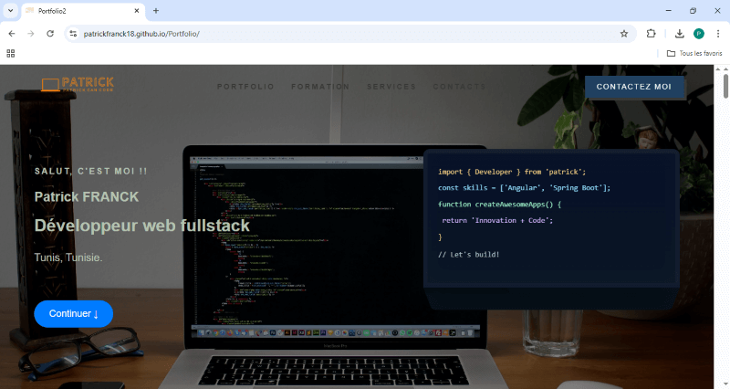

# 🚀 Angular Professional Portfolio

This is my professional portfolio built with **Angular 18**. It showcases my projects, skills, and professional background with a focus on clean code and responsive design.

## ✨ Key Features
* **Fully Responsive:** Optimized for mobile, tablet, and desktop (check out the Education timeline!).
* **Modern Architecture:** Built using Angular's component-based structure.
* **Performance:** Fast loading times and smooth navigation.
* **Automated Deployment:** Integrated with GitHub Pages via CI/CD.

## 🛠️ Tech Stack
* **Framework:** Angular 18
* **Language:** TypeScript
* **Styling:** SCSS / CSS (BEM Methodology)
* **Icons:** IonIcons
* **Hosting:** GitHub Pages

## 📸 Screenshots

  

## 🚀 Installation & Local Development
If you want to run this project locally:
1. Clone the repo: `git clone https://github.com/patrickfranck18/portfolio.git`
2. Install dependencies: `npm install`
3. Run the server: `ng serve`
4. Open `http://localhost:4200`

## 📄 License
This project is [MIT](https://choosealicense.com/licenses/mit/) licensed.
Copyright © 2026 Patrick Franck.